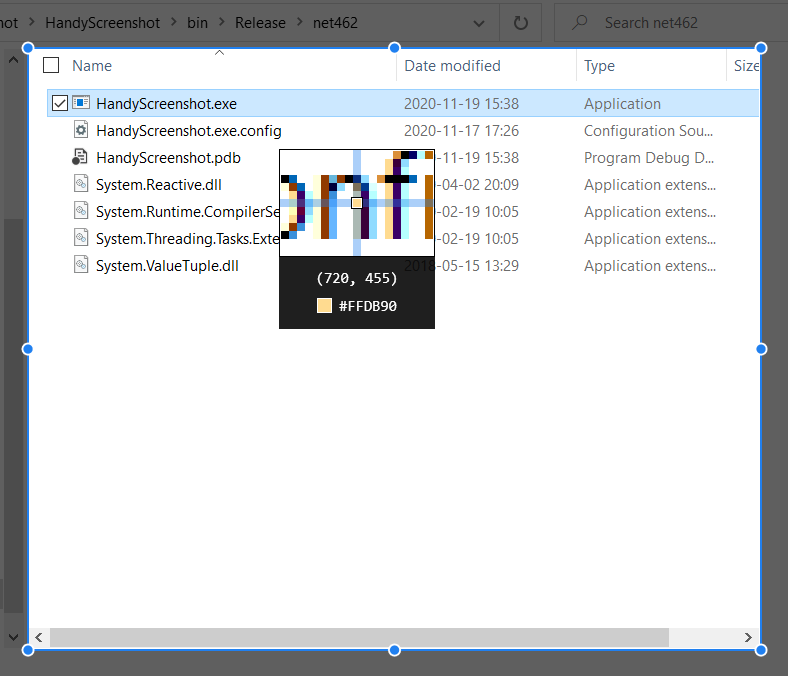

# HandyScreenshot

本项目是对目前 Windows 上最好用的截图工具 —— [Snipaste](https://www.snipaste.com/) —— 的一个模仿。不同点在于：Snipaste 采用 Qt/C++ 开发，未开源；本项目采用 WPF/C# 开发，并以 MIT 协议开源。旨在为 WPF 开发者提供一个参考案例。

目前本项目仍处于开发中，开发进度参考下方路径图。

## 路线图

* [x] 自动检测桌面 UI 元素外框，使裁剪框在 AutoDetect 模式下能够自动选中鼠标所在的 UI 元素；
* [x] Per-Monitor、High-Dpi 支持；
* [x] 截图裁剪框控件；
* [x] 放大镜控件：十字准星、颜色拾取器；
* [ ] 设置面板及 Tray Icon；
* [ ] 其它：集成 Toast 通知、全局/内置 HotKey 支持；
* [ ] 自动更新；
* [ ] 工具栏控件：
  * [ ] 截图相关基础功能：保存（到本地）、复制（到剪切板）、取消、Pin 在桌面；
  * [ ] 图片编辑相关功能：
    * [ ] 图形绘制：矩形/圆形绘制、直线/折线绘制、箭头、文字输入；
    * [ ] 涂鸦：笔、马克笔、马赛克；
    * [ ] 撤销/重做、橡皮擦；
